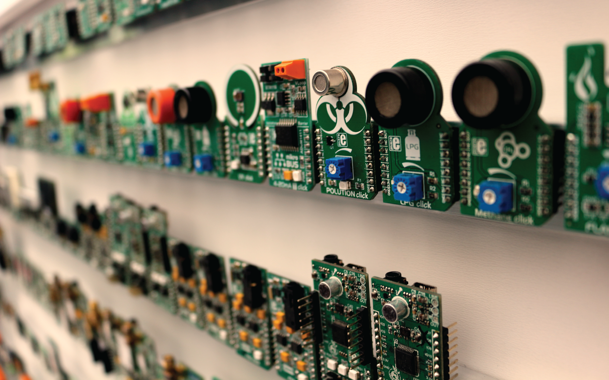
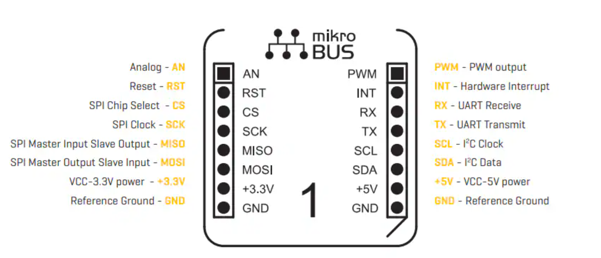

# MikroElectronica Click

---

Thousands of Click modules are offered by [MicroElekcronica](https://www.mikroe.com/). These modules range from basic to complex.

This standard includes multiple ways of connecting sensors, such as SPI or I2C. This opens the door the possibilities but also means more knowledge is necessary.

If this is your first hardware experience, start with [3-pin modules](threepin.md) and then move into [Qwiic and STEMMA](qwiic.md) modules.

Some drivers are already available for Click modules to make this a true plug-and-play.