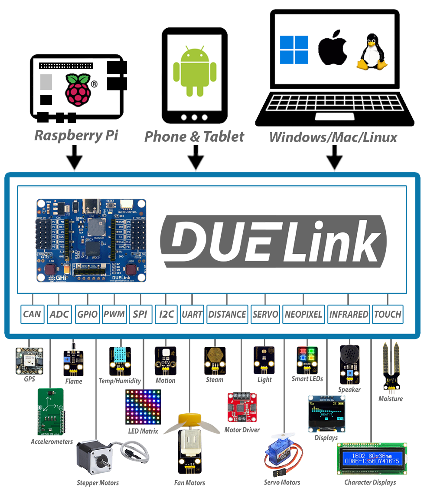

# DUELink Spider

Leverage your coding skills to code things right from a PC, a phone, or even a Raspberry Pi! Read sensors and control motors using Python and other languages - no hardware experience is necessary.

---

## We are Live on Kickstarter

[Back us on Kickstarter](https://www.kickstarter.com/projects/ghielectronics/duelink-bridging-software-to-hardware/) and secure your own.

