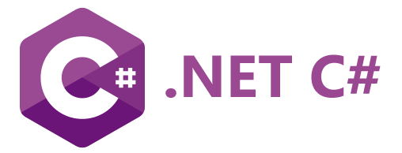

# .NET

---



The .NET DUELink library allows full .NET programs to access physical sensors and actuators. This allows complex .NET programs to do all the heavy lifting and send only the necessary components to control devices.

The provided library is implemented in C# but the user can use any .NET system, such as Visual Basic.

## Setup
This page assumes the user is already familiar with .NET C# and there is a development machine that is already setup to build and run .NET programs.

> [!TIP]
> Make sure your hardware is updated with the latest firmware listed on the [downloads](../downloads.md) page.

Start a new project with a simple line of code to test out the project is running

> [!TIP]
> C# Top level statements feature is being utilized, but not required.

```cs
Console.WriteLine("Hello, World!");
```
Download and install the latest `GHIElectronics.DUELink` library from NuGet.org. Alternatively, get it from the [downloads](../downloads.md) page.

## Blinky!

Our first program will blink the on-board LED 20 times, where it comes on for 200ms and then it is off for 800ms.

```cs
using GHIElectronics.DUELink;
Console.WriteLine("Hello DUE!");
var availablePort = DUELinkController.GetConnectionPort();
var duelink = new DUELinkController(availablePort);

// Flash the LED 20 times (on for 200ms and off for 800ms)
duelink.Led.Set(200, 800, 20);
Console.WriteLine("Bye DUE!");
```

## .NET API

The [API](../api/intro.md) page includes all details and examples to use all the available "physical world" services.

Use the above example program to initiate the hardware, instantiate the `duelink` object, and then use any of the available APIs, such as `duelink.Sound.Beep('p', 500, 1000)' to generate a one second 500Hz beep using the on-board peizo buzzer.


